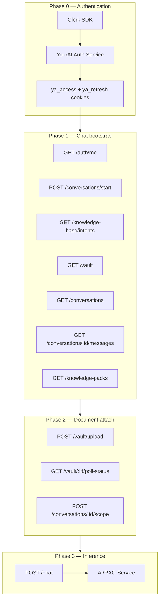
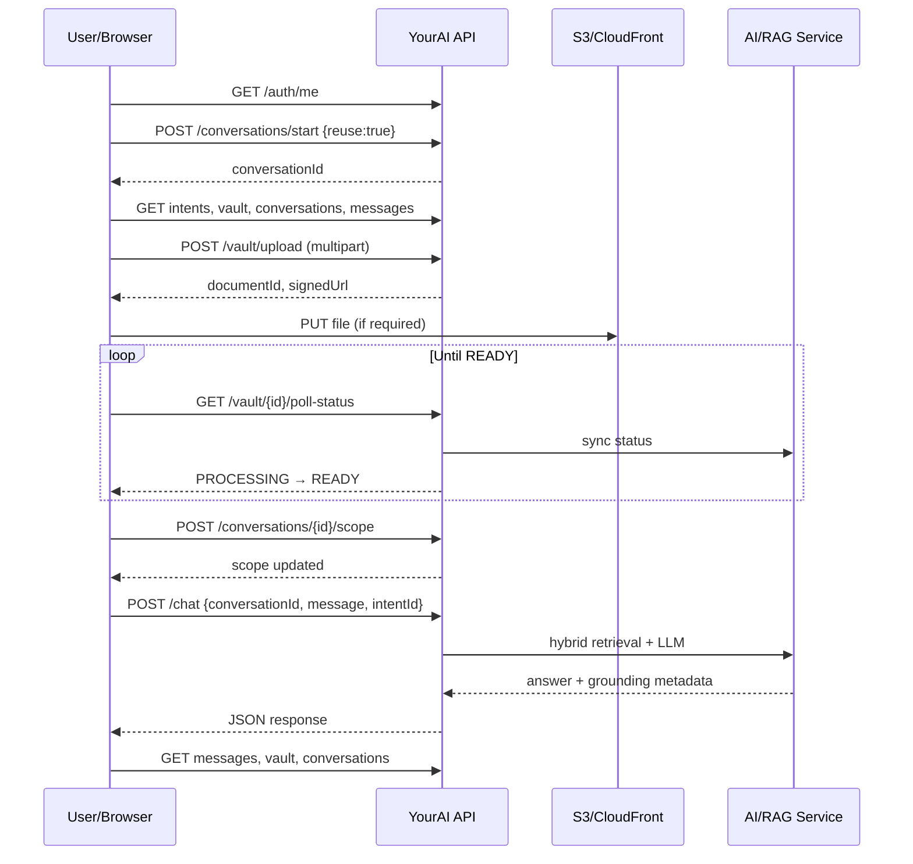

# YourAI PWA — End-to-End API Flow Specification

> **Purpose:** Shareable reference for automation, API testing, and Cursor agent analysis.  
> **Environment:** QA — `https://youraillc-pwa-qa.appskeeper.in`  
> **Evidence:** Screen recording (2026-06-03) + DevTools curls/responses  
> **Last updated:** 2026-06-03

---

## For Cursor agents — how to use this file

1. Read **Section 2 (Machine-readable summary)** first for IDs, endpoints, and variable chaining.
2. Follow **Section 10 (Automation recipe)** for ordered API execution.
3. Use **Section 11 (Test scenarios)** for pass/fail assertions.
4. Do **not** commit live JWT cookies or S3 signed URLs from Section 12 examples.
5. Related code in this repo: `packages/yourai-eval/` (HTTP provider, contracts).

**Quick context:** User logs in via Clerk → PWA sets `ya_access` / `ya_refresh` cookies → `/chat` bootstraps a `conversationId` → optional vault upload creates `documentId` → scope attaches doc to conversation → `POST /chat` runs RAG inference using `intentId` + scope (not document IDs in chat body).

---

## Table of contents

1. [Architecture overview](#1-architecture-overview)
2. [Machine-readable summary (JSON)](#2-machine-readable-summary-json)
3. [Entity model and relationships](#3-entity-model-and-relationships)
4. [Phase 0 — Login and session](#4-phase-0--login-and-session)
5. [Phase 1 — Chat bootstrap](#5-phase-1--chat-bootstrap)
6. [Phase 2 — User composes message (client-only)](#6-phase-2--user-composes-message-client-only)
7. [Phase 3 — Document upload and processing](#7-phase-3--document-upload-and-processing)
8. [Phase 4 — Attach document (scope)](#8-phase-4--attach-document-scope)
9. [Phase 5 — Chat inference](#9-phase-5--chat-inference)
10. [Phase 6 — Post-chat refresh](#10-phase-6--post-chat-refresh)
11. [Complete automation recipe](#11-complete-automation-recipe)
12. [Variable chaining (YAML)](#12-variable-chaining-yaml)
13. [API catalog](#13-api-catalog)
14. [Observed responses (examples)](#14-observed-responses-examples)
15. [Known failure modes](#15-known-failure-modes)
16. [Gaps to confirm with backend](#16-gaps-to-confirm-with-backend)
17. [Test scenarios](#17-test-scenarios)
18. [Security note](#18-security-note)

---

## 1. Architecture overview



**Core principle:** All `/api/v1/*` calls use **cookie authentication** (`ya_access`, `ya_refresh`, Clerk cookies). Maintain a cookie jar across requests.

---

## 2. Machine-readable summary (JSON)

```json
{
  "spec_version": "1.0",
  "environment": {
    "base_url": "https://youraillc-pwa-qa.appskeeper.in",
    "chat_route": "/chat",
    "api_prefix": "/api/v1"
  },
  "auth": {
    "type": "cookie",
    "cookies": ["ya_access", "ya_refresh", "__clerk_db_jwt", "__client_uat"],
    "identity_provider": "Clerk",
    "access_jwt_claims": ["sub", "email", "role", "org", "mfaVerified", "type"],
    "refresh_jwt_claims": ["sub", "sid", "role", "type"]
  },
  "entities": {
    "userId": "8d9bcb04-d4ee-46e5-873d-28fc7bbecc01",
    "orgId": "780fb721-4ebd-4ed4-8ebd-43c39e7184cf",
    "role": "ORG_ADMIN",
    "conversationId_example": "bf9186ae-e687-4dbd-a48a-b5a09d69696c",
    "documentId_example_video": "0b03e5f3-07ad-4355-b103-05c1177c1189",
    "documentId_example_curl": "59328094-3fdb-4400-a471-aeb3b1330524"
  },
  "intents": {
    "GENERAL_CHAT": "5d280a37-92c9-40b4-a253-767a810a08ea",
    "DOCUMENT_SUMMARISATION": "9304b526-9d94-4417-9cb0-66f06df14fa1"
  },
  "flow_order": [
    "auth_cookies",
    "GET /auth/me",
    "POST /conversations/start",
    "GET /knowledge-base/intents",
    "GET /knowledge-packs",
    "GET /vault",
    "GET /conversations",
    "GET /conversations/{id}/messages",
    "POST /vault/upload",
    "GET /vault/{id}/poll-status",
    "POST /conversations/{id}/scope",
    "POST /chat"
  ],
  "critical_rules": [
    "documentId in scope MUST equal upload.response.data.id",
    "conversationId in chat MUST equal start.response.data.conversationId",
    "intentId for summarization MUST be DOCUMENT_SUMMARISATION not GENERAL_CHAT",
    "wait for poll-status: status=READY and processingStatus=ready before chat",
    "document IDs are NOT sent in POST /chat body; they come from scope"
  ]
}
```

---

## 3. Entity model and relationships

| Entity | Format | Created by | Used by | Notes |
|--------|--------|------------|---------|-------|
| **userId** | UUID | Clerk + YourAI provisioning | JWT `sub`, `uploadedById` | User account |
| **orgId** | UUID | Org membership | JWT `org`, `organizationId` on docs | Tenant scope |
| **sessionId** | string | Login | JWT `sid` in `ya_refresh` | Session binding |
| **conversationId** | UUID | `POST /conversations/start` | scope, messages, chat | Chat thread |
| **documentId** | UUID | `POST /vault/upload` | poll-status, scope, RAG | Vault record |
| **intentId** | UUID | Pre-seeded (`GET intents`) | `POST /chat` | Prompt + routing |
| **inferenceId** | string | `POST /chat` response | Debug/trace | e.g. `py-5c98e0ce-...` |

```
User (userId)
 └── Organization (orgId)
      ├── Conversations (conversationId)
      │    ├── Scope: document_ids[], knowledge_pack_ids[]
      │    └── Messages (via chat + GET messages)
      └── Vault Documents (documentId)
           ├── S3/CloudFront (fileUrl, signedUrl)
           └── AI index (processingStatus, ocrStatus)
```

---

## 4. Phase 0 — Login and session

Recording starts **already logged in**. Login is two-layer: Clerk + YourAI JWT cookies.

### 4.1 Clerk (identity)

| Step | API | Output |
|------|-----|--------|
| Load SDK | `clerk.browser.js` | Clerk client |
| Environment | `GET .../environment?__clerk_...` | Instance config |
| Client | `GET .../client?__clerk_api_version=...` | Auth UI config |
| Sign-in | Clerk-hosted flow | Clerk session |
| Cookies | Set by Clerk | `__clerk_db_jwt`, `__client_uat` |

**Automation:** Use Playwright + Clerk UI, or inject pre-generated cookies.

### 4.2 YourAI JWT cookies

| Cookie | JWT `type` | Lifetime (observed) | Claims |
|--------|------------|---------------------|--------|
| `ya_access` | `access` | ~15 min | `sub`, `email`, `role`, `org`, `mfaVerified` |
| `ya_refresh` | `refresh` | ~7 days | `sub`, `sid`, `role` |

**Example `ya_access` payload (decoded):**

```json
{
  "sub": "8d9bcb04-d4ee-46e5-873d-28fc7bbecc01",
  "email": "kamal@yopmail.com",
  "role": "ORG_ADMIN",
  "org": "780fb721-4ebd-4ed4-8ebd-43c39e7184cf",
  "mfaVerified": false,
  "type": "access"
}
```

---

## 5. Phase 1 — Chat bootstrap

**Trigger:** Navigate to `/chat`  
**APIs:** Sequential + parallel reads

### 5.1 GET `/api/v1/auth/me`

| | |
|---|---|
| **Purpose** | Validate session; load user profile |
| **When** | Page load (twice: before and after Clerk init) |
| **Creates** | Nothing |
| **Save** | `userId`, `orgId`, `role` |

### 5.2 POST `/api/v1/conversations/start`

```json
{"reuse": true}
```

| | |
|---|---|
| **Purpose** | Get or create active conversation |
| **`reuse: true`** | Reuse existing open conversation |
| **Creates** | **conversationId** |
| **Save** | `conversationId` |

**Example response:**

```json
{
  "success": true,
  "data": {
    "conversationId": "bf9186ae-e687-4dbd-a48a-b5a09d69696c",
    "createdAt": "2026-06-03T09:45:49.807Z"
  }
}
```

### 5.3 GET `/api/v1/knowledge-base/intents`

| | |
|---|---|
| **Purpose** | Load all chat intents (13 in QA) |
| **Creates** | Nothing |
| **Save** | Map `intent key → intentId` |

**Key intents:**

| key | intentId |
|-----|----------|
| `GENERAL_CHAT` | `5d280a37-92c9-40b4-a253-767a810a08ea` |
| `DOCUMENT_SUMMARISATION` | `9304b526-9d94-4417-9cb0-66f06df14fa1` |

`DOCUMENT_SUMMARISATION` keywords include: `summarise document`, `document summary`, `executive summary`, `brief this contract`.

### 5.4 Parallel bootstrap reads

| Endpoint | Purpose |
|----------|---------|
| `GET /api/v1/knowledge-packs?limit=100` | Knowledge pack list |
| `GET /api/v1/vault?page=1&limit=100&tab=ALL` | Vault sidebar listing |
| `GET /api/v1/conversations?limit=3` | Recent chats sidebar |
| `GET /api/v1/conversations/{conversationId}/messages` | Message history |

### Bootstrap order

```
1. GET  /auth/me
2. POST /conversations/start          → conversationId
3. GET  /knowledge-base/intents       → intentId map
4-7. Parallel: knowledge-packs, vault, conversations, messages
```

---

## 6. Phase 2 — User composes message (client-only)

**APIs:** None while typing.

**Observed UI behavior:**
- User typed: *"Hi good morning can you do document summarization for me"*
- Banner: **"Looks like Document Summarisation"** — user kept **General Chat**
- `POST /chat` still sent `intentId` = GENERAL_CHAT

**Rule:** UI suggestion ≠ API intent. Automation must set `intentId` explicitly.

---

## 7. Phase 3 — Document upload and processing

### 7.1 POST `/api/v1/vault/upload`

**Content-Type:** `multipart/form-data`

| Field | Type | Required | Example |
|-------|------|----------|---------|
| `file` | binary | Yes | `.docx` bytes |
| `name` | string | Yes | `"Noida Double Murder Case"` |
| `description` | string | No | `""` |
| `tags` | JSON string | No | `"[]"` |

| | |
|---|---|
| **Status** | `201 Created` |
| **Creates** | **documentId**, DB record, S3 path |
| **Initial state** | `status: PROCESSING`, `processingStatus: registered`, `ocrStatus: PENDING` |
| **Also returns** | `signedUrl` (S3 presigned) |
| **Save** | `documentId` = `response.data.id` |

**Note:** DevTools "Copy as cURL" often has empty file body. Automation must use real multipart (`-F "file=@path"`).

### 7.2 GET `/api/v1/vault/{documentId}/poll-status`

| | |
|---|---|
| **Purpose** | Sync indexing state from AI service |
| **When** | Loop every 1–3s after upload |
| **Gate** | `status == "READY"` AND `processingStatus == "ready"` |

**State machine:**

```
PROCESSING / registered
    → READY / ready        ← proceed to scope + chat
    (ocrStatus may stay PENDING for docx)
```

**Ready message:** `"Document status synced from AI service."`

**Video note:** Status can briefly flip READY → PROCESSING. Poll until **stable** READY.

---

## 8. Phase 4 — Attach document (scope)

### POST `/api/v1/conversations/{conversationId}/scope`

```json
{
  "document_ids": ["<documentId>"],
  "attached_document_ids": ["<documentId>"],
  "active_vault_document_id": null,
  "knowledge_pack_ids": []
}
```

| Field | Role |
|-------|------|
| `document_ids` | Docs in retrieval scope |
| `attached_document_ids` | UI-attached docs (same IDs in observed flow) |
| `active_vault_document_id` | Focused doc (`null` = none) |
| `knowledge_pack_ids` | KB packs in scope |

| | |
|---|---|
| **When** | After upload ready, **before** `POST /chat` |
| **Creates** | Scope binding on conversation |
| **Response** | `"Conversation scope updated successfully"` |

**Critical:** `document_ids[0]` MUST equal `upload.response.data.id`.

**Chat effect:** `retrievalSummary.scope_locked: true`

---

## 9. Phase 5 — Chat inference

### POST `/api/v1/chat`

```json
{
  "conversationId": "<uuid from start>",
  "message": "<user text>",
  "intentId": "<uuid from intents>",
  "retrievalMode": "hybrid"
}
```

| Field | Source | Notes |
|-------|--------|-------|
| `conversationId` | `/conversations/start` | Must match scoped conversation |
| `message` | User input | Plain text |
| `intentId` | `/knowledge-base/intents` | Drives prompt + routing |
| `retrievalMode` | UI default | `"hybrid"` observed |

**Document IDs are NOT in chat body** — they come from conversation scope.

### Response fields for assertions

| Field | Greeting (success) | Summarization (failure) |
|-------|--------------------|---------------------------|
| `data.answerStatus` | `grounded` | `ungrounded` |
| `data.status` | `success` | `ungrounded` |
| `data.success` | `true` | `false` |
| `data.outputIntent` | `general_chat` | `general_chat` |
| `data.sourcesUsed` | `[]` | `[]` |
| `data.unusedSources[0].reason` | — | `no_chunks_above_threshold` |
| `data.retrievalSummary.chunks_retrieved` | `0` | `19` |
| `data.retrievalSummary.scope_locked` | `false` | `true` |
| `data.latencyMs` | ~2000 | ~7700 |

---

## 10. Phase 6 — Post-chat refresh

UI refetches after chat (not required for inference):

```
GET /api/v1/conversations/{conversationId}/messages
GET /api/v1/conversations?limit=3
GET /api/v1/vault?page=1&limit=100&tab=ALL
```

---

## 11. Complete automation recipe

```
PHASE 0 — AUTH
  Obtain cookies: ya_access, ya_refresh, __clerk_db_jwt

PHASE 1 — BOOTSTRAP
  1. GET  /api/v1/auth/me
  2. POST /api/v1/conversations/start  {"reuse": true}
         → SAVE conversationId
  3. GET  /api/v1/knowledge-base/intents
         → SAVE intentIds
  4-7. Parallel: knowledge-packs, vault, conversations, messages

PHASE 2 — UPLOAD (document tests)
  8. POST /api/v1/vault/upload (real multipart file)
         → SAVE documentId
  9. LOOP GET /api/v1/vault/{documentId}/poll-status
         UNTIL status=READY AND processingStatus=ready

PHASE 3 — SCOPE
  10. POST /api/v1/conversations/{conversationId}/scope
          use documentId from step 8

PHASE 4 — CHAT
  11. POST /api/v1/chat
  12. ASSERT answerStatus, sourcesUsed, retrievalSummary

PHASE 5 — OPTIONAL
  13. GET messages, conversations, vault
```

---

## 12. Variable chaining (YAML)

```yaml
session:
  base_url: "https://youraillc-pwa-qa.appskeeper.in"
  cookies:
    ya_access: "<from login — do not commit>"
    ya_refresh: "<from login — do not commit>"
    __clerk_db_jwt: "<from login — do not commit>"

from_jwt_ya_access:
  userId: "8d9bcb04-d4ee-46e5-873d-28fc7bbecc01"
  orgId: "780fb721-4ebd-4ed4-8ebd-43c39e7184cf"
  role: "ORG_ADMIN"

from_start:
  conversationId: "${POST /conversations/start → data.conversationId}"

from_intents:
  intentId_GENERAL_CHAT: "5d280a37-92c9-40b4-a253-767a810a08ea"
  intentId_DOCUMENT_SUMMARISATION: "9304b526-9d94-4417-9cb0-66f06df14fa1"

from_upload:
  documentId: "${POST /vault/upload → data.id}"
  signedUrl: "${POST /vault/upload → data.signedUrl}"

scope_payload:
  document_ids: ["${documentId}"]
  attached_document_ids: ["${documentId}"]
  active_vault_document_id: null
  knowledge_pack_ids: []

chat_payload_summarization:
  conversationId: "${conversationId}"
  message: "Please summarise the attached document."
  intentId: "${intentId_DOCUMENT_SUMMARISATION}"
  retrievalMode: "hybrid"

chat_payload_greeting:
  conversationId: "${conversationId}"
  message: "hi whats your name"
  intentId: "${intentId_GENERAL_CHAT}"
  retrievalMode: "hybrid"
```

---

## 13. API catalog

| # | Method | Endpoint | Auth | Creates | Depends on |
|---|--------|----------|------|---------|------------|
| 1 | GET | `/api/v1/auth/me` | cookies | — | login |
| 2 | POST | `/api/v1/conversations/start` | cookies | `conversationId` | login |
| 3 | GET | `/api/v1/knowledge-base/intents` | cookies | — | login |
| 4 | GET | `/api/v1/knowledge-packs?limit=100` | cookies | — | login |
| 5 | GET | `/api/v1/vault?page=1&limit=100&tab=ALL` | cookies | — | login |
| 6 | GET | `/api/v1/conversations?limit=3` | cookies | — | login |
| 7 | GET | `/api/v1/conversations/{id}/messages` | cookies | — | `conversationId` |
| 8 | POST | `/api/v1/vault/upload` | cookies | `documentId` | login |
| 9 | GET | `/api/v1/vault/{id}/poll-status` | cookies | — | `documentId` |
| 10 | POST | `/api/v1/conversations/{id}/scope` | cookies | scope binding | `conversationId`, `documentId` |
| 11 | POST | `/api/v1/chat` | cookies | messages, inference | `conversationId`, `intentId`, scope |

---

## 14. Observed responses (examples)

### Upload (201)

```json
{
  "success": true,
  "data": {
    "id": "59328094-3fdb-4400-a471-aeb3b1330524",
    "name": "Noida 100 Double Murder Case",
    "status": "PROCESSING",
    "ocrStatus": "PENDING",
    "processingStatus": "registered",
    "scope": "ORGANIZATION",
    "source": "VAULT"
  },
  "message": "Document upload completed."
}
```

### Poll-status (READY)

```json
{
  "success": true,
  "data": {
    "id": "59328094-3fdb-4400-a471-aeb3b1330524",
    "status": "READY",
    "ocrStatus": "PENDING",
    "processingStatus": "ready"
  },
  "message": "Document status synced from AI service."
}
```

### Chat — failed summarization (video)

**Request:**

```json
{
  "conversationId": "bf9186ae-e687-4dbd-a48a-b5a09d69696c",
  "message": "Hi good morning can you do document summarization for me",
  "intentId": "5d280a37-92c9-40b4-a253-767a810a08ea",
  "retrievalMode": "hybrid"
}
```

**Response (key fields):**

```json
{
  "answer": "I could not find enough information to summarize document summarization.",
  "answerStatus": "ungrounded",
  "status": "ungrounded",
  "success": false,
  "outputIntent": "general_chat",
  "outputIntentClassificationSource": "user_selected",
  "unusedSources": [{
    "kind": "UPLOADED_DOC",
    "id": "0b03e5f3-07ad-4355-b103-05c1177c1189",
    "reason": "no_chunks_above_threshold"
  }],
  "retrievalSummary": {
    "chunks_retrieved": 19,
    "chunks_used": 10,
    "retrieval_mode": "hybrid",
    "scope_locked": true
  },
  "latencyMs": 7675
}
```

### Chat — successful greeting

**Request:**

```json
{
  "conversationId": "bf9186ae-e687-4dbd-a48a-b5a09d69696c",
  "message": "hi whats your name",
  "intentId": "5d280a37-92c9-40b4-a253-767a810a08ea",
  "retrievalMode": "hybrid"
}
```

**Response (key fields):**

```json
{
  "answer": "I am Alex, a legal research assistant here to help with your firm's documents and general US legal concepts.",
  "answerStatus": "grounded",
  "status": "success",
  "success": true,
  "retrievalSummary": { "chunks_retrieved": 0, "chunks_used": 0 },
  "debugData": {
    "classifier": {
      "bucket": "chitchat",
      "override_path": "greeting_shortcircuit",
      "routing_layer": "regex_greeting"
    }
  },
  "latencyMs": 1962
}
```

---

## 15. Known failure modes

| # | Symptom | Cause | Fix |
|---|---------|-------|-----|
| 1 | `ungrounded` + `no_chunks_above_threshold` | Wrong `intentId` (GENERAL_CHAT) | Use DOCUMENT_SUMMARISATION |
| 2 | `sourcesUsed: []` | Scope `documentId` ≠ upload id | Chain from upload response |
| 3 | Ungrounded despite READY | Chat before stable ready | Poll until stable READY |
| 4 | Empty upload | curl without file bytes | Real multipart in automation |
| 5 | 401 mid-test | `ya_access` expired | Refresh or re-login |
| 6 | Wrong retrieval target | Mixed session IDs | One conversationId per test |

---

## 16. Gaps to confirm with backend

1. Token refresh endpoint (`ya_refresh` → new `ya_access`)
2. Clerk → YourAI token exchange API
3. `POST /conversations/start` with `reuse: false`
4. Whether client must PUT to `signedUrl` after upload
5. SSE/streaming support on `POST /chat`
6. Separate message POST vs only via `/chat`

---

## 17. Test scenarios

| ID | Scenario | Steps | Expected |
|----|----------|-------|----------|
| T1 | Greeting | bootstrap → chat (GENERAL_CHAT) | `answerStatus: grounded`, 0 chunks |
| T2 | Doc summarization (correct) | upload → poll → scope → chat (DOCUMENT_SUMMARISATION) | `sourcesUsed` has doc, grounded |
| T3 | Doc summarization (bug repro) | same as T2 but GENERAL_CHAT | `ungrounded`, `no_chunks_above_threshold` |
| T4 | Scope mismatch | scope with wrong documentId | retrieval failure |
| T5 | Chat before ready | skip poll wait | ungrounded or error |
| T6 | Session reuse | two runs `reuse: true` | verify conversationId behavior |

---

## 18. Security note

Do **not** commit live `ya_access`, `ya_refresh`, or S3 `signedUrl` values. Use CI secrets or per-run login.

---

## Appendix — Sequence diagram (full flow)



---

## Appendix — Related repo files

| Path | Purpose |
|------|---------|
| `packages/yourai-eval/src/yourai_eval/contracts/yourai_chat_api.py` | Test case / request shapes |
| `packages/yourai-eval/src/yourai_eval/providers/http.py` | HTTP provider |
| `packages/yourai-eval/datasets/agentic_api_example.jsonl` | Example test rows |
| `video_analysis_frames/manifest.json` | Video frame extraction metadata |
